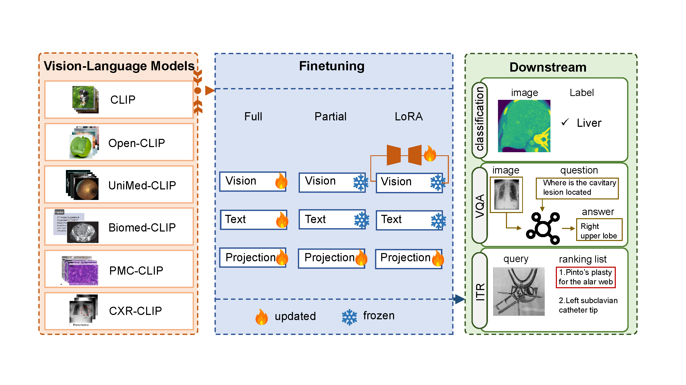

# Comparison-between-CLIPs-in-Healthcare-using-Explainability-Methods
This is the repository of paper: General or Medical CLIP: Which one shall we choose?



## Environment Setup
```
conda env create --file environment.yml
conda activate CompFM
python model_name/task
```

## Experiments
The experiments include four CLIP-based models: CLIP, Biomed-CLIP, PMC-CLIP and CXR-CLIP, containing zero-shot, fine-tuning testing. All the settings are included in each model folder.

### Code Structure
- model_name
  - VQA.py: finetuning/prediction for VQA
  - classification.py: prediction for classification
  - finetuning.py: finetuning for classification
  - i2t.py: finetuning/prediction for I2T

